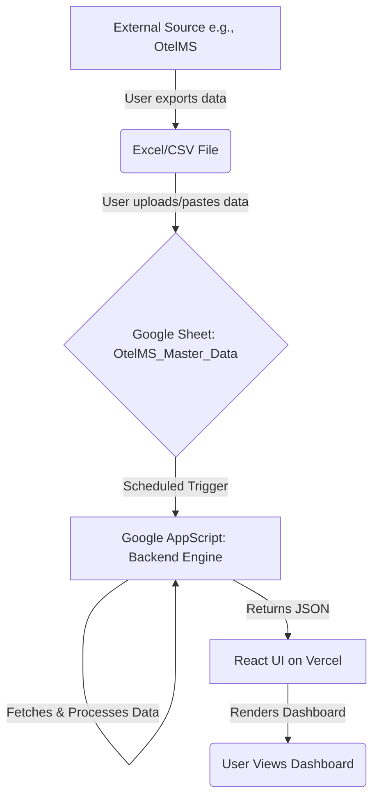

# PowerStack HotelOS Architecture (2025)

This document outlines the official architecture of the PowerStack HotelOS, a Google-First, Serverless, AI-Powered system for managing 60 apartments at Orbi City, Batumi.

---

## Core Philosophy

Our architecture is dictated by the **[POWERSTACK_MANIFESTO.md](POWERSTACK_MANIFESTO.md)**. Key principles are:

- **Zero Server Overhead:** No paid servers or databases.
- **Google-First:** Leverage Google Workspace for all backend operations.
- **AI-Driven:** Gemini is the core decision-making engine.

---

## The PowerStack Technology Stack

| Layer | Technology | Role | Justification |
|---|---|---|---|
| **Frontend** | Vite + React + Tailwind CSS | UI Display & Input | Fast, modern, and stateless. The "Ocean Theme" provides our visual identity. Deployed on Vercel. |
| **Backend** | Google AppScript | Serverless Engine | Hosts all APIs, triggers, and business logic. Executes tasks based on UI requests or time-based triggers. |
| **Database** | Google Sheets | Single Source of Truth | Stores all operational data (reservations, finances, housekeeping). Accessible, auditable, and free. |
| **AI Brain** | Google Gemini Flash 1.5 API | Decision & Content Engine | Analyzes data from Sheets, generates text (review replies, emails), and provides insights. Called via AppScript. |

---

## Data Flow: The "Manual Bridge" Concept

Since we do not have a live API to external systems (like OtelMS), we use a robust manual data flow that ensures stability and data integrity.

### Explanation:

1.  **Data Export:** The user manually exports reservation or financial data from an external system (e.g., OtelMS) into an Excel or CSV file.
2.  **Google Sheet Update:** The user updates the master Google Sheet (`OtelMS_Master_Data`) with this new data. This is the **only** point of manual data entry.
3.  **AppScript Backend:** A time-triggered or on-demand Google AppScript function reads the data from the Google Sheet.
4.  **API Endpoint:** The AppScript exposes a simple API endpoint that returns the processed data as a clean JSON object.
5.  **React Frontend:** The React application, hosted on Vercel, fetches this JSON from the AppScript URL and renders the UI components (charts, tables, KPIs).

This "Manual Bridge" decouples our system from unstable external dependencies and ensures the dashboard always reflects the "Single Source of Truth" in the Google Sheet.

---

## Deprecated Technologies

The following technologies have been **fully deprecated and removed** from the PowerStack architecture:

- **Supabase:** All Supabase clients and backend logic have been removed.
- **PostgreSQL:** We do not use any form of SQL database.
- **Node.js / Express.js Backend:** All server-side logic is now handled by Google AppScript. The `server/` directory in this repository is for archival reference only and is not part of the deployed application.
- **Email Parsers:** All email scraping and parsing logic has been archived and is no longer in use.

This streamlined, Google-centric architecture ensures maximum stability, zero overhead, and powerful AI capabilities.
